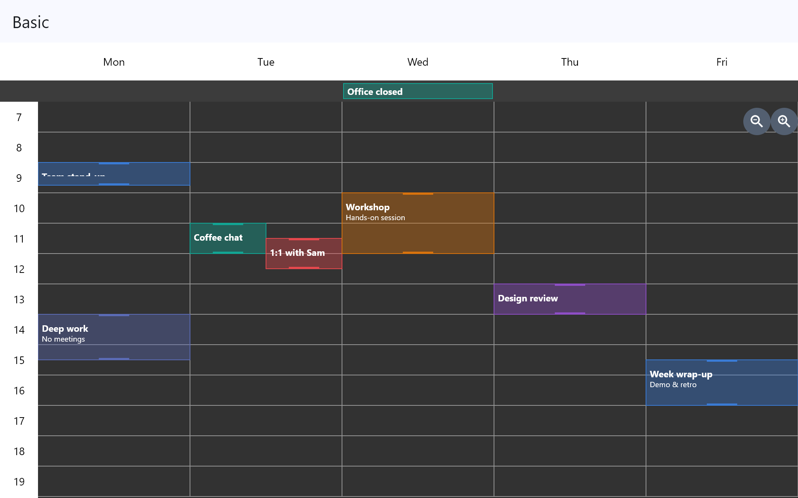
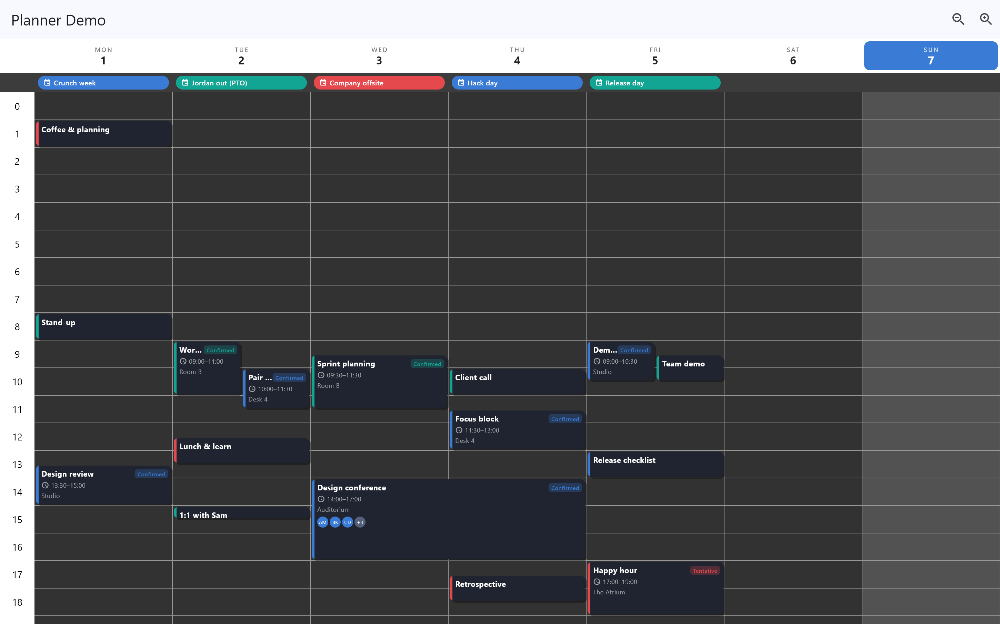
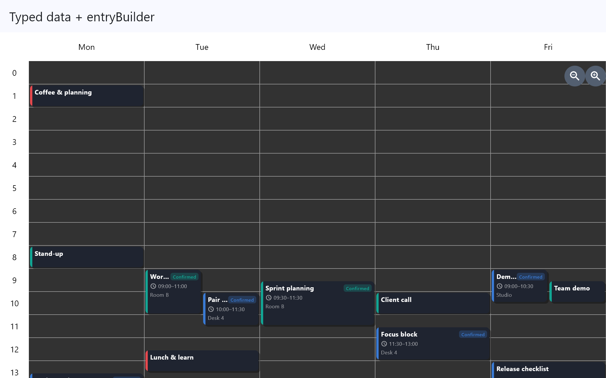
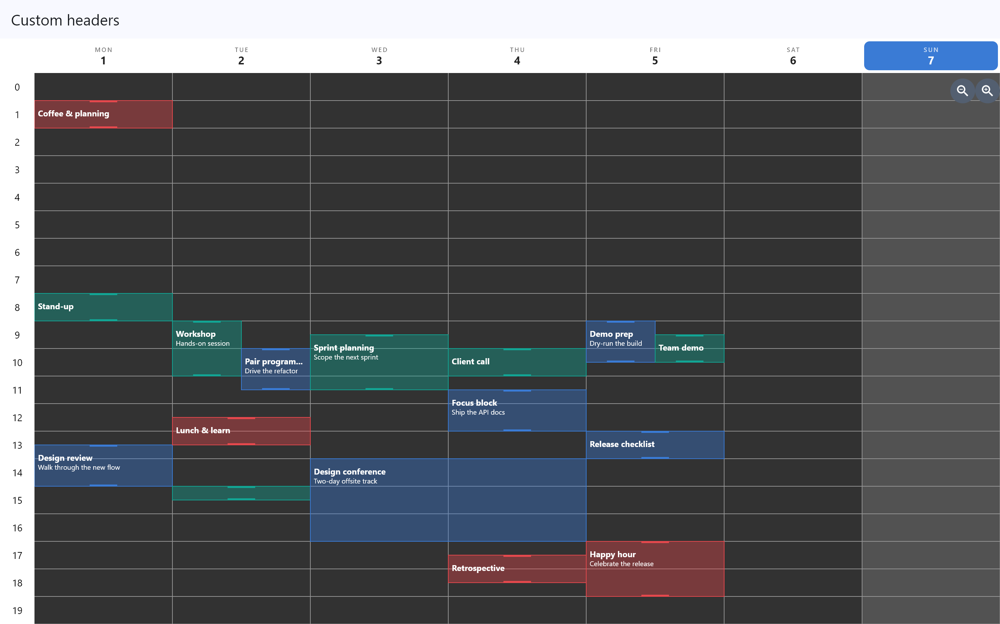
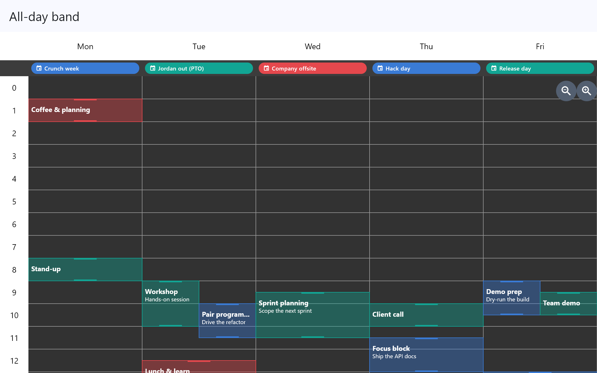
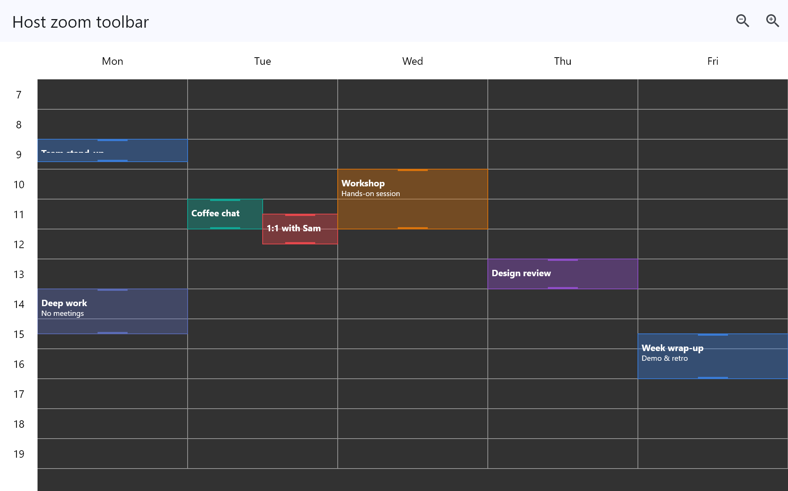
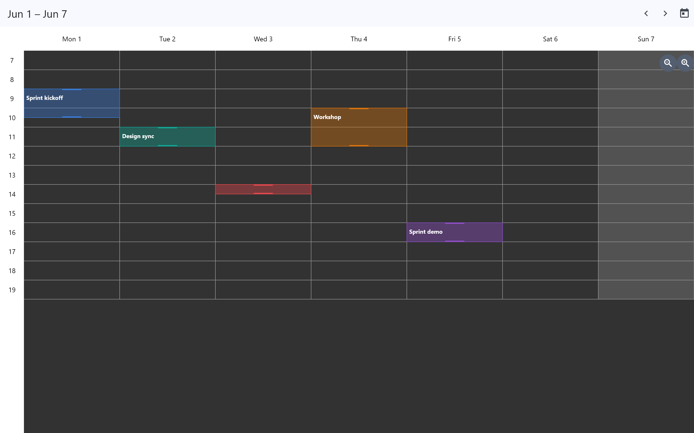

# planner

A Flutter widget that renders a scrollable, zoomable day-grid of events on a
custom-painted canvas. Show several labelled columns side by side, each split
into hours, and let users pan, zoom, and drag events to move or resize them. It
is **column-based, not date-based** — a "day" is an index into the `labels` you
provide, so it works for days, rooms, machines or any lanes; optional
[calendar helpers](doc/calendar.md) add real dates on top.

<p align="center">
  
  
</p>

> Screenshots are generated from the example app; see [#93](https://github.com/pebble-world/planner/issues/93).

## Features

- Multiple labelled columns with an hour grid drawn on a single `CustomPaint`.
- 2D panning, single-axis pan via the date row / hour gutter, and mouse-wheel
  scroll with `Shift` / `Ctrl` modifiers ([interactions](doc/interactions.md)).
- Zoom the time axis with pinch, `Ctrl`+wheel, or the built-in +/- buttons — or
  drive it from your own chrome with a [`PlannerController`](doc/controller.md).
- Desktop drag-to-edit (move a body, resize an edge) with hover cursors; touch
  keeps one-finger drag for panning and exposes an `onEntryLongPress` hook.
- Create / edit / delete via double-tap or a right-click context menu, with
  per-event accessibility semantics for screen readers.
- Customizable colors and text styles, a "today"-style
  [column highlight](doc/interactions.md#highlighting-a-column-today-style), and
  a localizable [context menu](doc/interactions.md#localizing-the-context-menu).
- **Fully custom widgets** via opt-in [builders](doc/builders.md): branded
  day/column headers, real-widget events that shed detail by pixel height, and
  custom all-day chips — each reading a typed `PlannerEntry<T>.data` payload.

## Getting started

Add the package to your `pubspec.yaml`:

```yaml
dependencies:
  planner: ^0.3.0
```

Then import it:

```dart
import 'package:planner/planner.dart';
```

## Usage

```dart
import 'package:flutter/material.dart';
import 'package:planner/planner.dart';

class CalendarPage extends StatelessWidget {
  const CalendarPage({super.key});

  @override
  Widget build(BuildContext context) {
    final entries = [
      PlannerEntry(
        id: '1',
        time: PlannerTime(day: 0, hour: 8, minutes: 0, duration: 60),
        title: 'Stand-up',
        content: 'Daily team sync',
        color: Colors.green,
      ),
      PlannerEntry(
        id: '2',
        time: PlannerTime(day: 1, hour: 13, minutes: 30, duration: 90),
        title: 'Design review',
        content: 'Walk through the new flow',
        color: Colors.blue,
      ),
    ];

    return Planner(
      entries: entries,
      config: PlannerConfig(
        labels: const ['Mon', 'Tue', 'Wed', 'Thu', 'Fri'],
        minHour: 0,
        maxHour: 23,
        onEntryCreate: (time) {
          // A user asked to create an event at this slot.
        },
        onEntryEdit: (entry) {
          // A user double-tapped / chose "Edit" on an event.
        },
        onEntryDelete: (entry) {
          // A user chose "Delete" on an event.
        },
        onEntryMove: (entry) {
          // A user finished dragging/resizing; entry.time is updated.
        },
      ),
    );
  }
}
```

Your callbacks own the data: update your own list of entries (and call
`setState`) in response — the widget reports interactions but does not persist
them.

## Examples

A gallery of runnable examples lives in [`example/`](example/lib/main.dart),
ordered basic → advanced. Each page demonstrates one feature on its own; the
final Showcase combines them all.

| Preview | Example | What it shows |
|---------|---------|---------------|
|  | [Basic](example/lib/examples/basic_example.dart) | A minimal planner with the default look and `onEntry*` callbacks. |
|  | [Typed data + entryBuilder](example/lib/examples/typed_data_example.dart) | A typed `PlannerEntry<T>.data` payload read back in a custom event card. |
|  | [Custom headers](example/lib/examples/custom_headers_example.dart) | A `CalendarWindow` + `dayHeaderBuilder` with a "today" highlight. |
|  | [All-day band](example/lib/examples/all_day_example.dart) | Enabling the all-day band and drawing custom chips. |
|  | [Host zoom toolbar](example/lib/examples/host_zoom_example.dart) | Driving zoom from your own chrome via a `PlannerController`. |
|  | [Week calendar](example/lib/examples/week_calendar_example.dart) | A real week with prev/next navigation built on `calendar.dart`. |
|  | [Showcase](example/lib/examples/showcase_example.dart) | Every customization hook wired together on one screen. |

The thumbnails are generated by the screenshot target ([#93](https://github.com/pebble-world/planner/issues/93)).

## Documentation

| Guide | Covers |
|-------|--------|
| [Core concepts](doc/core-concepts.md) | The column-based time model, the core types, and the `onEntry*` callbacks. |
| [Builders](doc/builders.md) | Typed `PlannerEntry<T>.data`, and the `entryBuilder` / `dayHeaderBuilder` / `allDayEntryBuilder` widget hooks. |
| [Calendar](doc/calendar.md) | A date-based week calendar with `CalendarWindow` from `package:planner/calendar.dart`. |
| [Controller](doc/controller.md) | Driving and observing zoom from a host toolbar with `PlannerController`. |
| [Interactions](doc/interactions.md) | The mouse / touch / accessibility map, context-menu localization, and column highlighting. |

## Additional information

- **Changelog:** [CHANGELOG.md](CHANGELOG.md).
- **Issues / contributions:** <https://github.com/pebble-world/planner/issues> — PRs welcome.

## License

[MIT](LICENSE) © yvan vander sanden

This package vendors third-party source code under its own license; see
[THIRD_PARTY_NOTICES.md](THIRD_PARTY_NOTICES.md).
